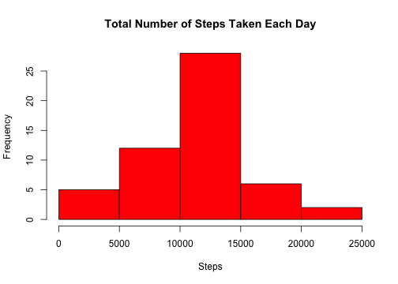
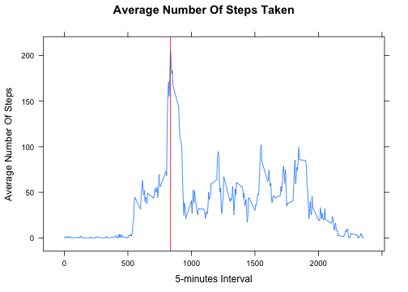
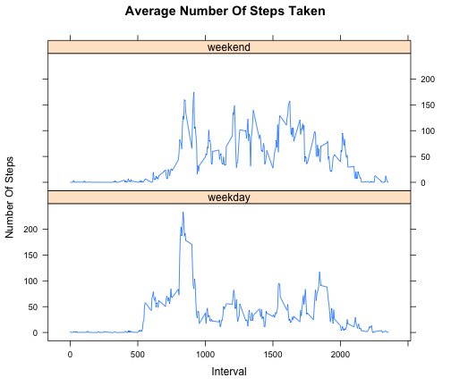

# Reproducible Research: Peer Assessment 1


## Loading and preprocessing the data

Unzip and read the CSV file.


```r
unzip("activity.zip", overwrite=T)
df <- read.csv("activity.csv",
               header=T,
               colClasses=c("numeric", "character", "numeric"),
               na="NA")
```

## What is mean total number of steps taken per day?

1) Create a new aggregate for the number of steps per day.


```r
stepsPerDay <- aggregate(steps ~ date, data=df, sum)
colnames(stepsPerDay) <- c("date", "steps")
```

Create a histogram using the aggregate.


```r
hist(stepsPerDay$steps, 
     main="Total Number of Steps Taken Each Day",
     xlab="Steps",
     col="red")
```

 


```r
meanTotalStepsPerDay <- mean(stepsPerDay$steps, na.rm=T)
medianTotalStepsPerDay <- median(stepsPerDay$steps, na.rm=T)
```

2) The mean total number of steps taken per day is 
**10766.19**.

The median total number of steps taken per day is 
**10765**.

*Note: We ignored days for which no steps have been recorded.*


## What is the average daily activity pattern?
1) Create a new aggregate for the mean of steps per interval


```r
stepsPerInterval<- aggregate(steps ~ interval, data=df, mean)
colnames(stepsPerInterval) <- c("interval", "steps")
```

Plot a time series plot using the aggregate (also get the max value so that we 
can show it on the graph and as a number later in the report)


```r
# Get the interval for which the steps are max.
maxInterval <- stepsPerInterval[
    stepsPerInterval$steps == max(stepsPerInterval[,"steps"]),
    "interval"]

# Plot a time series for the mean steps per interval
xyplot(steps ~ interval,
       data=stepsPerInterval, 
       type="l",
       xlab="5-minutes Interval",
       ylab="Average Number Of Steps",
       main="Average Number Of Steps Taken",
       panel = function(x, y, ...) {
            # Plot default graph
            panel.xyplot(x, y, ...)
            # Plot a vertical red line to hightlight the interval with the max mean steps
            panel.abline(v=maxInterval, col="red") 
       })
```

 

2) Find the interval with the most steps...


```r
# Moved calculation of maxInternal above so that we can add a line to the graph
```

On average across all the days in the dataset, **835** is the 
interval containing the maximum number of steps.


## Imputing missing values

```r
missingValuesCount <- nrow(df[is.na(df$steps), ])
```
1) The total number of missing values in the dataset is 
**2304**.

2) The imputing strategy is as follows:

1. Check if the number of steps for one interval is NA (not available). Zeros are considered to be a valid number of steps.
    
2. Replace the NA value for that interval with the mean number of steps taken for that interval across all the days.

3) Create a new dataset that is equal to the original dataset but with the 
missing data filled in.


```r
# Create a copy of df
df.imputed <- df

# Replace all NA values for a given interval with the mean number of steps for 
# that interval across all the days
df.imputed$steps <- ifelse(is.na(df.imputed$steps), 
                           stepsPerInterval[stepsPerInterval$interval == 
                                                df.imputed$interval, "steps"], 
                           df.imputed$steps)
```
4) Make a histogram of the total number of steps taken each day


```r
# Create a new aggregate for the number of steps per day.
stepsPerDay.imputed <- aggregate(steps ~ date, data=df.imputed, sum)
colnames(stepsPerDay.imputed) <- c("date", "steps")

# Create a histogram using the aggregate.
hist(stepsPerDay.imputed$steps, 
     main="Total Number of Steps Taken Each Day (Imputed)",
     xlab="Steps",
     col="red")
```

 

```r
# Calculate mean and median
meanTotalStepsPerDay.imputed <- mean(stepsPerDay.imputed$steps)
medianTotalStepsPerDay.imputed <- median(stepsPerDay.imputed$steps)
```

The mean total number of steps taken per day is 
**10766.19**.

The median total number of steps taken per day is 
**10765.59**.


```r
totalRecordsCount <- nrow(df)
missingValuesPercentage <- 100 * missingValuesCount / totalRecordsCount
```

The impact of filling missing values is very negligible even though 
13% were missing. We can 
notice a slight increase of the central bar but overall filling
missing data with mean values had little impact on the median total number of steps per day and no impact on the mean total number of steps per day.

Here is a summary of the results:

<!-- html table generated in R 3.1.2 by xtable 1.7-4 package -->
<!-- Sun Nov 16 19:24:09 2014 -->
<table border=1>
<tr> <th>  </th> <th> Total Number of Steps Per Day </th> <th> With Missing Values </th> <th> With Imputated Values </th>  </tr>
  <tr> <td align="right"> 1 </td> <td> Mean </td> <td> 10766.19 </td> <td> 10766.19 </td> </tr>
  <tr> <td align="right"> 2 </td> <td> Median </td> <td> 10765 </td> <td> 10765.59 </td> </tr>
   </table>

## Are there differences in activity patterns between weekdays and weekends?
1) Create a new factor variable in the dataset with two levels -- "weekday" and "weekend" indicating whether a given date is a weekday or weekend day.


```r
df.imputed$dayType <- factor(
    ifelse(weekdays(as.POSIXlt(df.imputed$date)) %in% c("Saturday", "Sunday"),
           "weekend", 
           "weekday"), 
    labels=c("weekday", "weekend"))
```

2) Make a panel plot containing a time series plot of the 5-minute interval (x-axis) and the average number of steps taken, averaged across all weekday days or weekend days (y-axis).

Create a new aggregate for the mean of steps per interval...


```r
stepsPerInterval.imputed<- aggregate(steps ~ interval + dayType, data=df.imputed, mean)
colnames(stepsPerInterval.imputed) <- c("interval", "dayType", "steps")
```

... and finally, create the plot:


```r
# Plot a time series for the mean steps per interval
xyplot(steps ~ interval | dayType,
       data=stepsPerInterval.imputed,
       layout=c(1, 2),
       type="l",
       xlab="Interval",
       ylab="Number Of Steps",
       main="Average Number Of Steps Taken")
```

 
